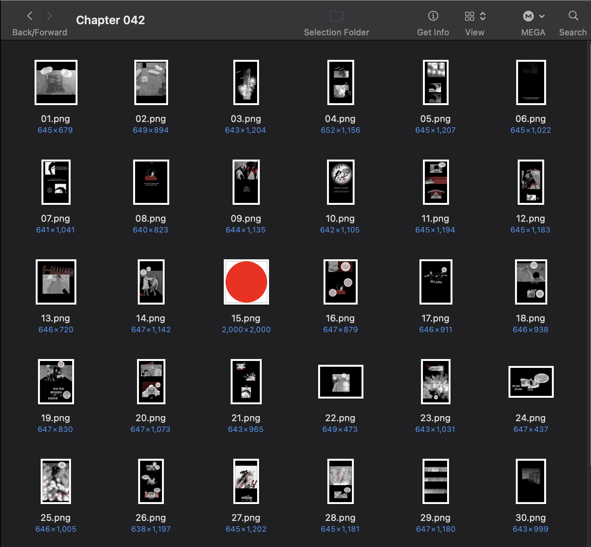

# Image Processing Tools
### 1. Image_Adjustment_by_Multiplier.py

  > _(it is recommanded to use merge_manga.py before using this script)_ <br>
  
  this script, makes sure all images have 2.5 (you can change this number in code) times the hieght than width for example to have (720*1800) ---> 1800 = 720 * 2.5 <br>
  it crops and adds from the next image in the folder to the image that is being processed to get the desired height

> [!NOTE]
> there is a tolerance variable here for width, meaning, if the width is 720px in the current image but the next image is 721px, it overlook it and still vertically merge them

> [!NOTE]
> if the width of the images are significantly different then the merging doesn't happen, instead the image gets ignored UNLESS the next image after that has the same width, the the merging with the new width starts

> [!WARNING]
> the images have to be either "png", "jpg", "jpeg", "webp", you can add more in the code yourself, also remember that the saved images in Output is in webp for size reduction, Quality = 80, it is NOT LossLess

> [!WARNING]
> the script assumes the images are numerically named and sorted, otherwise it will not work as intended


WHY?
to make them readable, there are so many Comic books, Manga, Manhwa,... that are not cropped correctly when you download them <br>
Apps like HakuNeko, download them in a really bad format

below is an example, of what will happen to the images, (left) the original images, (right) after running the script and getting the output <br>
as you can see, i dropped a big image (2000*2000) in there to make you see what will happen to unfit images, as you can see, it skips it (the reason for adding this, is because of Ads that are thrown in these Mangas), we don't want them getting merged with the work


<table>
  <tr>
    <td></td>
    <td></td>
  </tr>
</table>

## Usage

To use this Python script, you need to have Python installed on your system. You can run the script from the terminal by providing the path to the folder you want to process as an argument. and providing the path to the folder that the output will be saved

### Running the Script

1. **Open Terminal**: Navigate to the directory where your script is located.

2. **Run the Script**: Use the following command format to execute the script:

   ```bash
   python Image_Adjustment_by_Multiplier.py /path/to/your/Input_folder  /path/to/your/Output_folder 

  <hr>

### 2. merge_manga.py
  this script, is mostly useful after using HakuNeko app to download full Chapters of a manga, the script take a path of a folder containing all chapters (subdirectories) containing images <br>
  loops through chapters using **_re_** library (finding the chapters order) <br>
  and starts naming them using a "counter" that starts from 1, and puts all images in order, in one final folder containing all images of all chapters sequentially
  >useful to be used for Image_Adjustment_by_Multiplier.py later


the images have to be in either of these formats '.png', '.jpg', '.jpeg', '.gif', '.bmp', '.webp', '.jxl', '.avif' (you can add more in the code)


  the script makes sure, _Anamolies_ are handled (**Using Priority System that you can Change in Code**) as well, as below:<br>
  - Prologue (as last chapter if there is no "chapter" in the begining of the folder's name)
  - Epilogue (last chapter)
  - Creator's Note (last chapter)
  - Side story (considered after the chapters, example: "chapter 40 [final]", "Side story 1", "Side story 2",...)
  - volume (checks for numbers, if Volume 1, then checks for all sub chapters to list them)
  - episode (equevelant as "chapter", if "chapter" exist, moves to the last)
  - oneshot (only 1 chapter)
  - ch (same as chapter if the name starts with it following numbers)


below is an example of how the script works, left (before running the script), right (after running the script)

<table>
  <tr>
    <td></td>
    <td></td>
  </tr>
</table>

the images are processed in the following order, with the following priorites
Sorted chapters (with sort keys):
1. Chapter 1 -> (1, 1, 1.0, 'Chapter 1')
2. Chapter 2 -> (1, 1, 2.0, 'Chapter 2')
3. ch 3 -> (1, 1, 3.0, 'ch 3')
4. episode 4 -> (1, 1, 4.0, 'episode 4')
5. Side story 1 -> (5, 1, 1.0, 'Side story 1')
6. Side story 2 -> (5, 1, 2.0, 'Side story 2')
7. Creator's Note -> (6, 1, 0, "Creator's Note")


all the images are now in a new folder called "final", in the same directory that contains all the chapters

## Usage

To use this Python script, you need to have Python installed on your system. You can run the script from the terminal by providing the path to the folder you want to process as an argument.

### Running the Script

1. **Open Terminal**: Navigate to the directory where your script is located.

2. **Run the Script**: Use the following command format to execute the script:

   ```bash
   python merge_manga.py /path/to/your/folder/with chapters

  <hr>

### 3. Run_ImageMultiplier_on_ALL_Folders.py && batch_merger.py
these scripts are useful if you have multiple folders and mangas and you don't want to run merge_manga.py or Image_Adjustment_by_Multiplier.py, one by one

batch_merger.py runs the "merge_manga.py" on all the Mangas in the folder that is given as argument
Run_ImageMultiplier_on_ALL_Folders.py runs Image_Adjustment_by_Multiplier.py on 


## Usage

Run_ImageMultiplier_on_ALL_Folders.py
this script expect a path to a Folder, the Folder will have multiple Subdirectories, inside each subdirectory HAS TO BE a folder named "final", this final folder will have all the images
here the structure of the folders <br>
- Collection Folder
  - manga1
    - final
      - 1.png
      - 2.png
  - manga2
    - final
      - 1.png
      - 2.png

<br>

   ```bash
   python Run_ImageMultiplier_on_ALL_Folders.py /path/to/Collection Folder
  ```


## Usage
batch_merger.py <br>
the script, expect a Folder, with many Manga Folders in them, each Manga Folders will have many Chapter Folder, and those Chapter Folders will have images inside them, below is the structure

- Collection of Mangas
  - manga1
    - chapter 1
      - 1.png
      - 2.png
      - 3.png
    - Ch 2
      - 1.jpg
      - 2.png
      - 3.webp
    - side story
      - 1.png
      - 2.png
  - manga2
    - chapter 1
      - 1.png
      - 2.png
    - chapter 2
      - 1.png
      - 2.png
    - chapter 3
      - 1.png
      - 2.png
<br>

   ```bash
   python batch_merger.py /path/to/Collection of Mangas
  ```


> [!IMPORTANT]
> batch_merger should be in the same place as merge_manga.py
